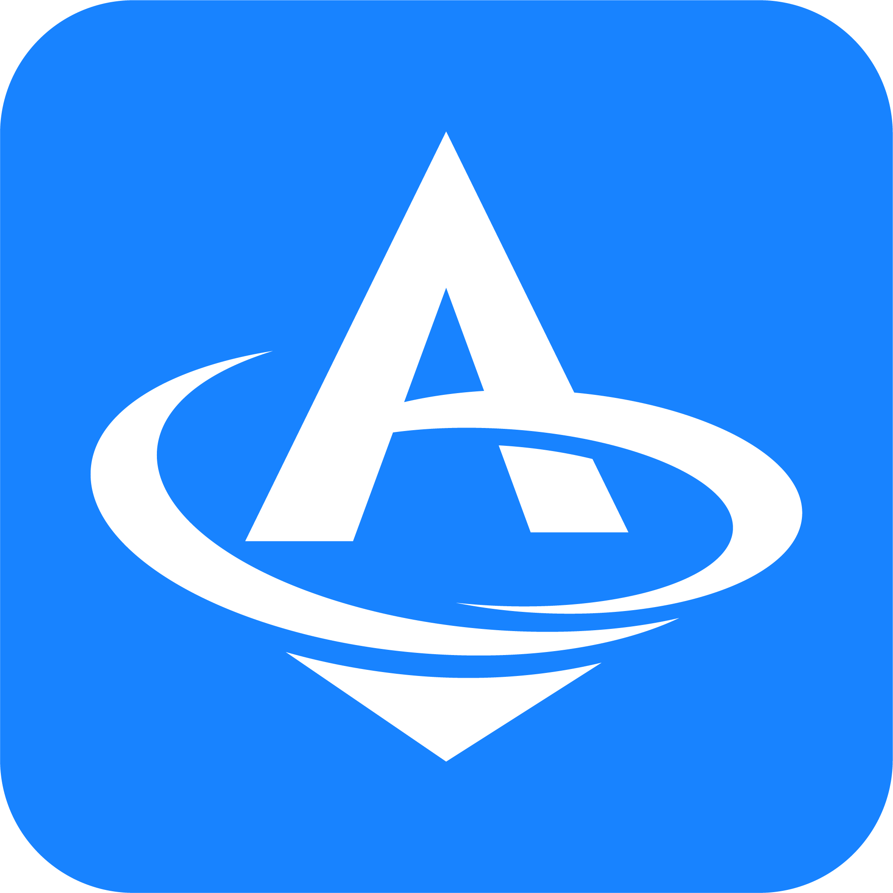
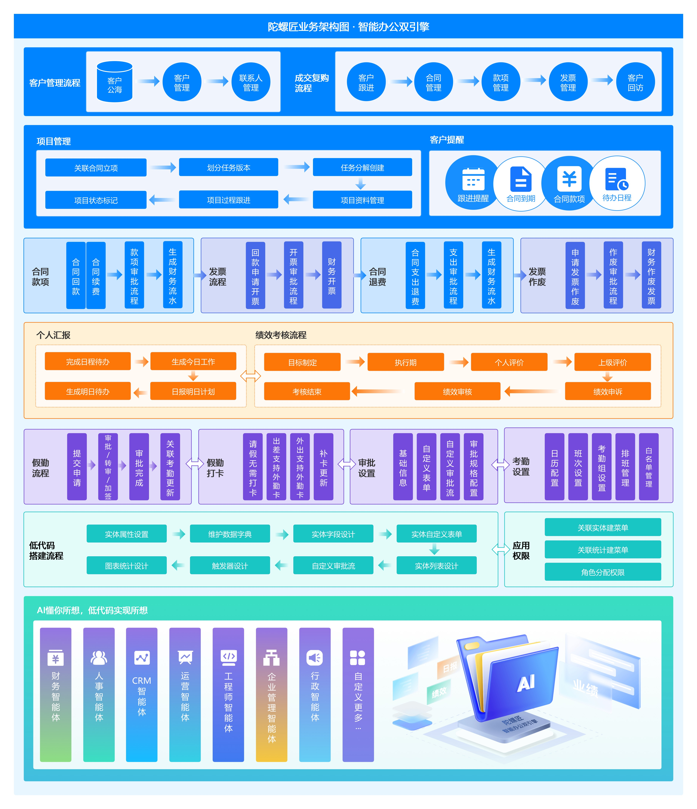
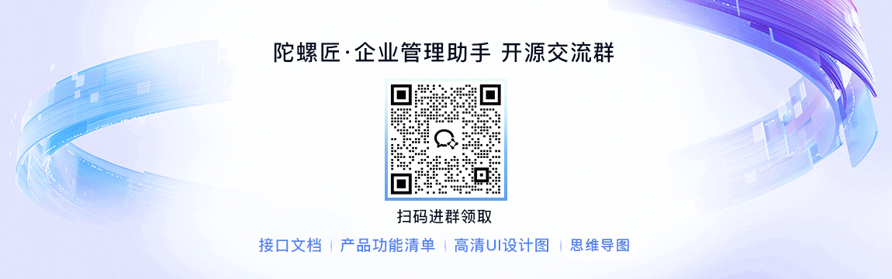

陀螺匠·AI+低代码双引擎智能办公系统

[官网](https://tuoluojiang.com)｜[在线体验](https://demo.tuoluojiang.com/)｜[帮助文档](https://doc.crmeb.com/tuoluojiang)｜[应用市场](https://www.crmeb.com/market/)｜[技术社区](https://www.crmeb.com/ask/thread/list/157)

**用心做开源，我们也很需要你的鼓励！右上角Star🌟，等你点亮！**

---

## 📝 项目介绍

《陀螺匠》是一套采用Laravel 9框架结合Swoole高性能框架与Vue.js前端技术栈构建的AI+低代码双引擎智能办公系统。陀螺匠深度融合了AI智能体以及低代码开发平台，系统简约，易于功能扩展，方便二次开发。旨在为企业提供一站式、数智化转型的全方位解决方案，助力企业高效运营与智能决策。

 **AI懂你所想，低代码实现你所想** 

[🔗功能列表](https://doc.crmeb.com/tuoluojiang/tuoluojiang20/21083)｜[📮提交反馈](https://www.crmeb.com/ask/thread/list/157)

---

## ✴️ 开源说明
开源说明：项目代码100%开源，基于 AGPL-3.0，支持免费商用！

技 术 栈：系统基于Laravel 9+Swoole+Vue.js 框架开发，前后端分离；

AI智能体：我们突破性地将NL2SQL（自然语言转SQL）技术融入陀螺匠管理系统，打造出陀螺匠智能AI，重塑办公体验，通过AI驱动+低代码双引擎协同，实现"所想即所查、所见即所得"，开启智能办公极速时代！

低 代 码：低代码可以通过可视化界面和预定义组件快速构建模块应用，减少编码工作，缩短应用开发周期；

功能模块：系统非插件模式，所见即所得，系统所有功能全部开源，并支持免费商用；

AI、低代码、考勤打卡、审批流、工作汇报、绩效管理、客户管理、合同管理、发票管理、业绩统计、项目管理、财务管理、组织架构、职级管理、岗位职责、企业动态、物资管理、云盘等……

不妨来亲自体验下！陀螺匠+AI 人工智能 又会擦出什么样的火花……

---

## 💯 系统亮点

1.前后端分离：后端Laravel9+Swoole，前端ElementUI+Vue；

2.代码规范：遵循PSR-2命名规范、Restful标准接口、代码严格分层、注释齐全；

3.权限管理：内置强大灵活的权限管理，RBAC权限模型；

4.开发配置：低代码增加配置、系统组合数据模块；

5.高性能：支持Redis缓存、队列、长连接、多种云储存；

6.低代码：自定义表单、自定义字段、自定义数据字典、自定义审批流、自定义列表展示、自定义触发事件、自定义图表统计、自定义对接接口，快速开发企业常见应用。

7.Ai智能体：
- 技术新突破，NL2SQL实现智能数据库交互
-  自定义智能体，灵活控制员工行为边界
- 深度整合企业业务数据、制度文档与低代码实体
- 联动多个功能模块，用一句话指令完成复杂操作

---

## 🏠 产品架构图

---

## 🖼️ 页面预览

---

## ✅ 帮助文档

官网地址：https://tuoluojiang.com
文档地址：https://doc.crmeb.com/tuoluojiang

---

## ✳️ 系统演示

PC端：**https://demo.tuoluojiang.com**

账号：**18888888888**  密码：**888888**

H5端：**https://demo.tuoluojiang.com/work**

账号：**18888888888**  密码：**888888**

项目会不定时进行更新，建议⭐star⭐和👁️watch👁️一份。

---

## 📚 运行配置

**服务器运行环境：**

PHP Nginx

PHP 8.0-8.2

MySQL 5.7-8.0

Redis

**前端运行环境：**

node版本：14.21.3

npm版本：6.14.18

**推荐新手刚入门使用如下配置：**

宝塔Linux控制面板

Nginx 1.1.8

MySQL 5.7

PHP 8.0

Supervisor管理器

---

## ⭕ 技术开发框架

**后端框架**

| 技术     | 版本号 | 官网 
| ----------- | ----------- | ----------- 
| laravel      |  9.52.16       | https://laravel.com 
| laravel-s    |  3.7.39      | https://github.com/hhxsv5/laravel-s
| laravel-route-attributes      |  1.20       | https://github.com/spatie/laravel-route-attributes 
| jwt-auth      |   2.1       | https://github.com/tymondesigns/jwt-auth 
| form-builder     |  2.0       | https://github.com/xaboy/form-builder 

**前端框架**

|技术| 名称 | 版本号| 官网 |
|----------- |----------- |----------- |-----------  |
| vue2      |  MVVM框架   | 2.6.10   | https://v2.cn.vuejs.org/v2/guide |
| elementUI      |  UI组件库  | 2.15.14  | https://element.eleme.cn |
| vuex      |  状态管理模式 + 库   | 3.1.0  | https://vuex.vuejs.org|
| vue-router  |  路由管理   | 3.0.2  | https://router.vuejs.org |
| webpack     | 静态模块打包工具  | 4.44.2   | https://www.webpackjs.com |

## 👊想要快速安装，教程来助攻！

宝塔安装教程：https://doc.crmeb.com/tuoluojiang/tuoluojiang19/19107

Linux安装教程：https://doc.crmeb.com/tuoluojiang/tuoluojiang19/19108

前端打包教程：https://doc.crmeb.com/tuoluojiang/tuoluojiang19/19212

---

## ⛽️二开支持

使用文档：https://doc.crmeb.com/tuoluojiang

接口文档：https://apifox.com/apidoc/shared-c280d902-20d4-491e-987f-c7aa7e6150e1

视频教程：https://www.bilibili.com/video/BV1t7qzYsE4a

技术社区：https://www.crmeb.com/ask/thread/list/157

---

## 📞 陀螺匠互动

**陀螺匠开源技术交流群**

**扫码进群可领取开源版产品功能清单、高清UI设计图、思维脑图！**

**技术社区！找方法、提bug、看官方消息、拿活跃大奖！都在 **[**CRMEB 技术社区**](https://www.crmeb.com/ask/thread/list/157)** 应有尽有~**

---

## 📸 特别鸣谢

排名不分先后，感谢这些软件的开发者：Laravel、Element-UI、Vue、Mysql、Redis、Echarts、Form-Create等，如有遗漏请联系我！

---

## 💾 版权信息

本项目包含的第三方源码和二进制文件之版权信息另行标注。

版权所有Copyright © 2017-2025 by 陀螺匠 (https://www.tuoluojiang.com)

All rights reserved。

陀螺匠商标和著作权所有者为西安众邦网络科技有限公司。

## 欢迎了解CRMEB多商户商城系统

